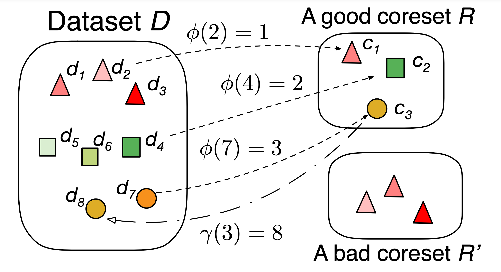

# FastCore

This repo contains the codes for our submitted paper.

     
    

# Quick Start

## Folder Structure

    .
    ├── config.py                 # codes for setting parameters
    ├── hidden.py                 # auxiliary functions to open or close outputs
    ├── utils.py                  # utility functions
    ├── main.py                   # evaluation of different methods
    ├── fastcore                  # codes of different datasets, group methods, coreset selection methods and networks
    └── requirements.txt          # requirements to run the codes

## Requirements
Before running the codes, please make sure the environment is set proporly according to `requirements.txt`. 
- `Python 3.7+`
- `FAISS-cpu`

The used dataset and preprocessing code are available at [link](https://drive.google.com/file/d/19e7o7_sa4L_HDiJh8oA3VhY76apf4Rid).

## Quick Start
Different experiments can be conducted by passing different parameters to `main.py`.
We explain some key parameters here.

> Coreset selection algorithm.
>> --selection [selection_algorithm]

We provide the codes for all the baselines used in the paper. 
Different baselines can be used by following arguments：

- **Full**:      `--selection Full`, trains over the full dataset, 
- **Uniform**:   `--selection Uniform`, sample items uniformly from the full dataset.
- **Stratified**: `--selection Stratified`, uses stratified sampling to sample items from  clusters produced by LSH.
- **DeepFool**: `--selection DeepFool`, selects data points close to the decision boundary as a coreset.
- **Glister**: `--selection Glister`, selects the coreset by optimizing its generalization error using bi-level optimization.
- **Craig**: `--selection Craig`, uses the typical 3-loop gradient approximation method to select a coreset.
- **Craig-PQ**: `--selection Scale --distAlg brute`, uses PQ to measure the feature distance between two items.
- **FastCore-Hull**: `--selection Scale --distAlg convex`, uses the convex hull to measure the distance between an item and a cluster.
- **FastCore**:  `--selection Scale --distAlg pqSDC`, uses PQ to measure the item-cluster distance.

**Note:** For FastCore-Hull and FastCore, if the training model is a deep neural network, `--selection Scale` should be replaced by `--selection ScaleDNN` 
in order to use the last layer gradient as feature vectors.

> Coreset proportion, i.e., the fraction of dataset to be selected as coreset.
>> --fraction [select_fraction]

For example, if you want to select a coreset with a proportion of 10%, you can use `--fraction 0.1`.

> Number of hyperplanes in LSH.
>> --LSHnbits [number]

For example, if you want to use 64 hyperplanes in LSH, you can use `--LSHnbits 64`.

> Number of subspaces.
>> --PQm [number]

For example, if you want to divide the dimensions into 4 subspaces, you can use `--PQm 4`.

There are many other parameters and we have provided detailed clarification for them, which can be found in `config.py`.

